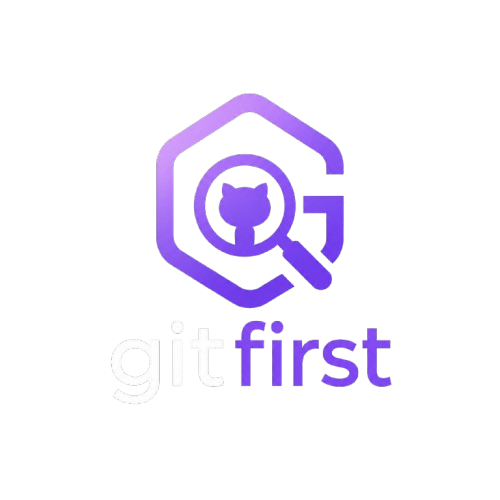

<p align="center">
  <a href="https://gitfirst.dev" target="_blank">
    
  </a>
</p>
<hr>

# gitfirst

**gitfirst** helps developers make their first open-source contribution by curating beginner-friendly issues from popular projects across all of GitHub.

Every hour, gitfirst automatically fetches the latest open issues labeled as beginner-friendly from thousands of public repositories — so you always see fresh opportunities.

## Tech Stack

| Layer | Technology |
|-------|-----------|
| Frontend | HTML, CSS, JavaScript (vanilla) |
| Data pipeline | Python 3.12 |
| Automation | GitHub Actions (hourly) |
| Hosting | Vercel |

## Issue Labels Tracked

gitfirst searches for issues with any of these labels:

`good first issue` · `beginner` · `beginner-friendly` · `easy` · `help wanted` · `first-timers-only` · `up-for-grabs` · `hacktoberfest` · `low-hanging-fruit` · `contributions welcome` · `newbie` · `jump in` · and more

## How It Works

```
Every hour (GitHub Actions)
        ↓
populate.py searches GitHub for public repos
with beginner-friendly issues (top 500 by stars)
        ↓
Generates data/generated.json + data/tags.json
        ↓
Commits fresh data to this repo
        ↓
Vercel detects the commit and redeploys
        ↓
Site live with fresh issues ✅
```

## Running Locally

```bash
python -m http.server 3000
```

Open http://localhost:3000 in your browser.

To fetch fresh data locally:

```bash
# Set your GitHub token
$env:GH_ACCESS_TOKEN = "your_token_here"

# Run the data pipeline
uv sync --all-extras
uv run python gfi/populate.py
```

## Contributing

See [CONTRIBUTING.md](CONTRIBUTING.md) for setup instructions and guidelines.

## License

MIT
